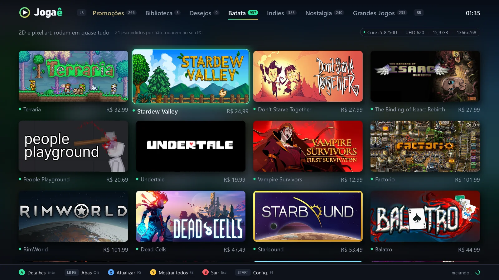

# Jogaê

**Seu PC não é lixo. Ele roda muita coisa boa.**

O Jogaê analisa o seu computador (processador, memória, placa de vídeo e resolução) e mostra só os jogos da Steam que rodam nele, com cara de videogame: tela cheia, música e navegação pelo controle.

- Site: https://jogae-br.github.io
- Baixar: [última versão](https://github.com/jogae-br/jogae/releases/latest)

## Recursos
- **Roda no meu PC?**: compara os requisitos de cada jogo com o seu hardware, inclusive vídeo integrado
- **Promoções** só de jogos compatíveis, com lista de desejos e aviso de desconto
- **Biblioteca** com os jogos da Steam instalados, instalação e download acompanhados pelo app
- Controle de Xbox, música e sons próprios, abertura animada

## Como instalar
1. Baixe o `Jogae.zip` na [página de versões](https://github.com/jogae-br/jogae/releases/latest)
2. Extraia a pasta e abra o `Jogae.exe`
3. Se aparecer "O Windows protegeu o computador": **Mais informações → Executar assim mesmo**

Requisitos: Windows 10 ou 11 (64 bits). Para jogar, é preciso ter a Steam.

O Jogaê é gratuito. O Jogaê não é afiliado à Valve Corporation nem à Steam.
